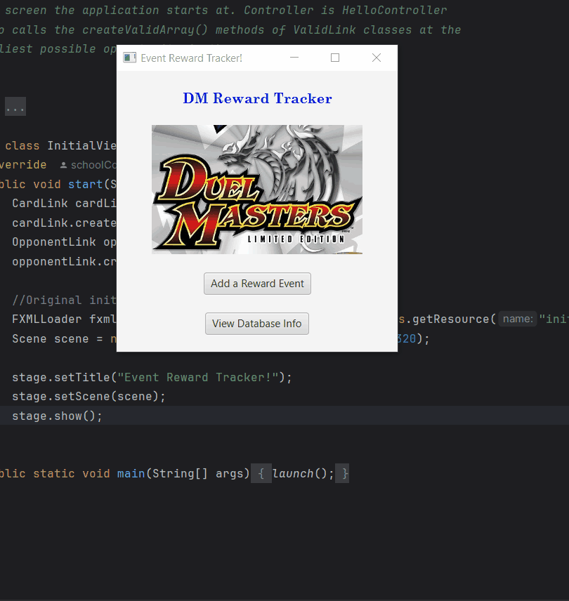
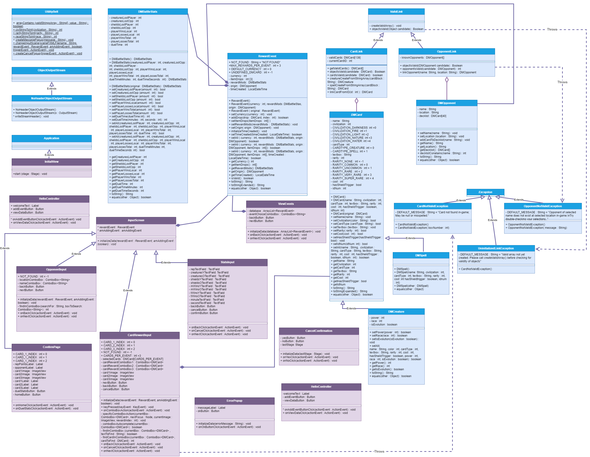
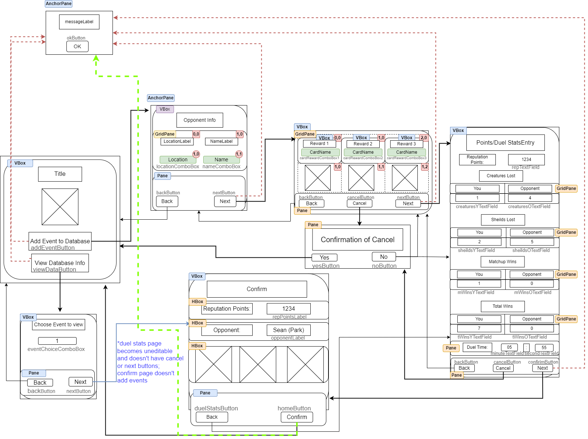

# Unit Deliverable 3 - Final Project : Duel Masters Reward Tracker

My brother and I have been trying to collect all of the cards in the Duel Masters PS2 video game, but It began to take
more and more time to collect the higher-rarity cards. However, it seemed like duels which gave higher rarity cards also
gave more Reputation Points, and we realized that if we could figure out what factors influence those results, we would be able
to determine the most efficient way to keep going after the cards we're still missing.

To that end, this purpose of this project is to have a way to track rewards for the Duel Masters PS2 video game; to create
a database which we can reference to see if there are any trends such as certain opponents giving better cards or more Reputation Points more often.

To achieve this, the user inputs the information they get from the game on each scene, which progress in the order the player
would be receiving the information in-game. Validity is checked at each stage (cards have to exist in-game, and the program parses
the DuelMastersCardsCleaned txt file for that info. Opponent link has an array of valid name&location combinations already coded).
At the end, a RewardEvent with all of that information is added to the eventDatabase.dat binary file.

The user can later choose an event (read from the eventDatabase.dat file) based on the time it was created and see all of the
information associated with that particular reward event.

## Demo

## UML Diagram

## Wireframe

## UD1 Concepts not used
Inner classes. There aren't any cases where there is information linked tightly to a specific class that isn't needed for another
class to reference at some point. There was a point when building the GUI when I tried using Spinners with editable TextFields for
the Duel Time input, and tried using inner classes to help filter out non-Integer input, but the spinners had their own issues
and I ended up leaving that input at TextFields.